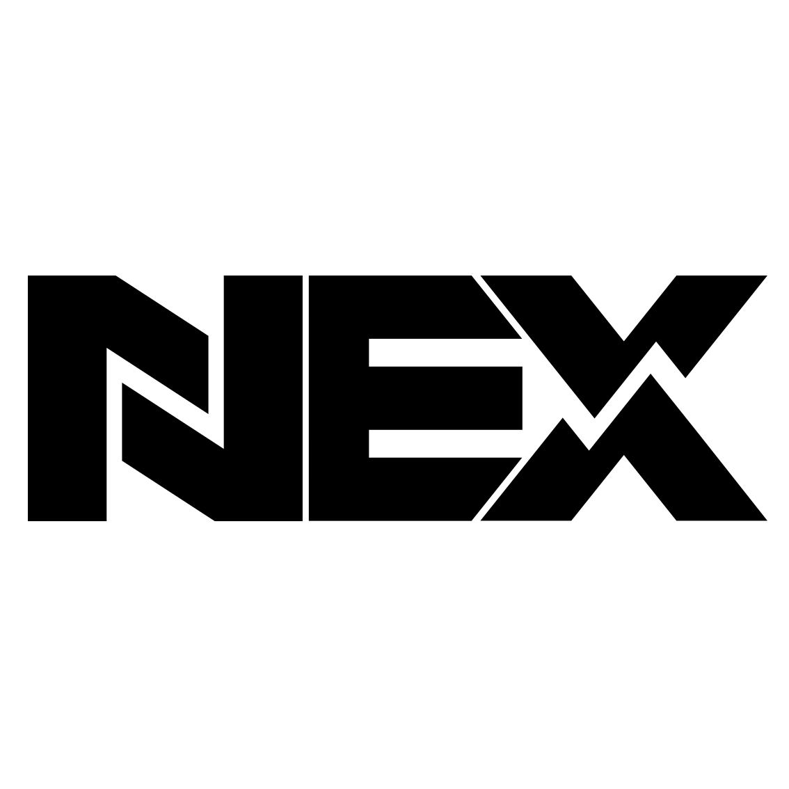
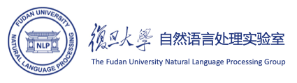
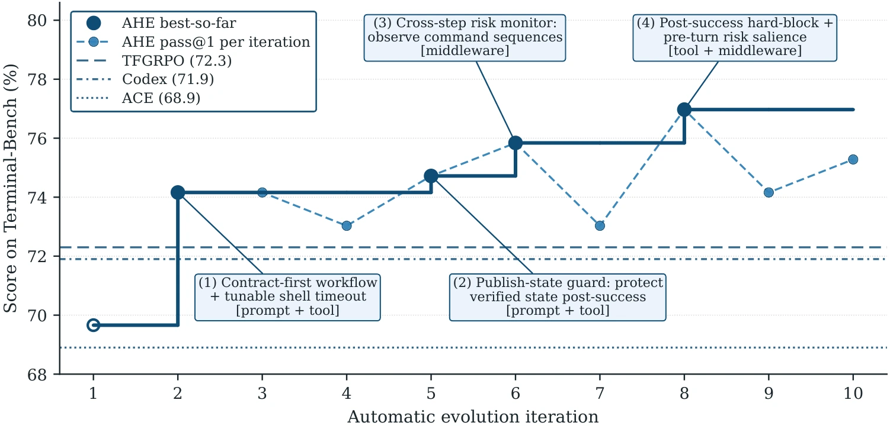
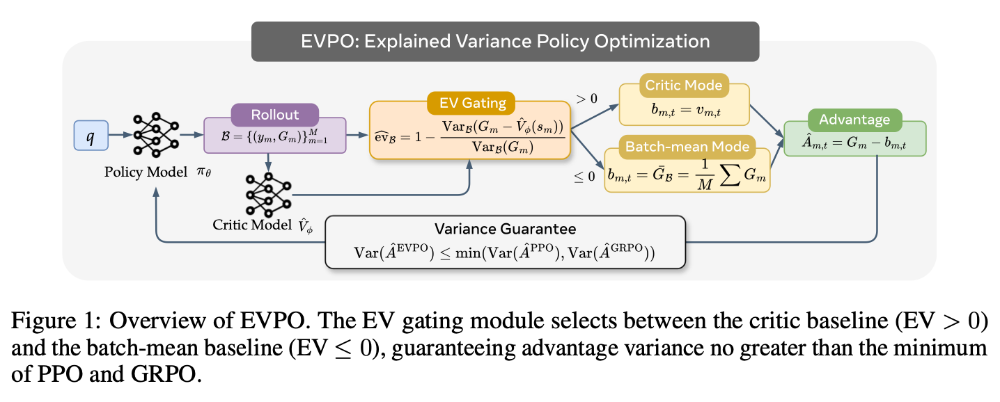
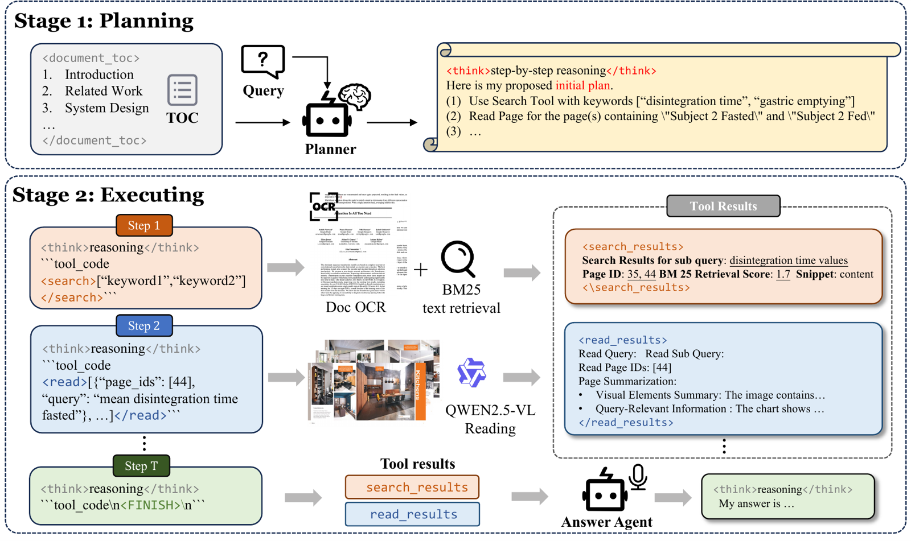
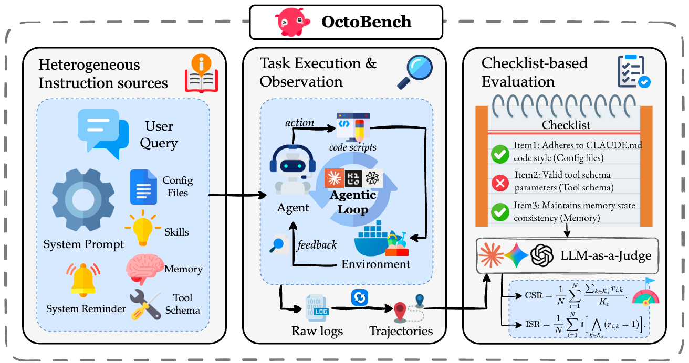
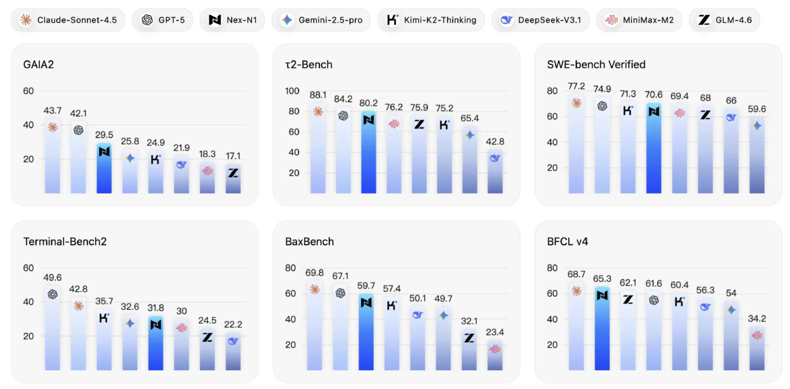

<!--
  Bilingual page. Every visible string has an English span (.lang-en) and a
  Chinese span (.lang-zh); the floating 中/EN button toggles which is shown.
  WHEN YOU EDIT THIS FILE YOU MUST UPDATE BOTH LANGUAGES — see /CLAUDE.md.
  Paper titles & author lists are intentionally English-only (academic convention).
-->

I am a master's student at FudanNLP Lab, Fudan University, co-advised by Associate Prof. [Tao Gui (桂 韬)](https://guitaowufeng.github.io/) and Prof. [Xuanjing Huang (黄萱菁)](https://xuanjing-huang.github.io/). My research focuses on **self-evoling agents** and **reinforcement learning**. I have end-to-end experience across the agent post-training stack — SFT (DeepSpeed, LLaMA-Factory), RL (verl, trl), and Harness Engineering. I am currently an Algorithm Researcher at NEX-AGI (Shanghai Qiji Zhifeng Co., Ltd.), and previously interned at the Computing Research Department of Huawei. I received my B.S. from Fudan University in 2025.我是复旦大学 FudanNLP 实验室的硕士研究生，师从[桂韬](https://guitaowufeng.github.io/)副教授与[黄萱菁](https://xuanjing-huang.github.io/)教授。我的研究方向为**自演化智能体（self-evolving agents）**与**强化学习**。我在智能体后训练全链路上拥有端到端经验——SFT（DeepSpeed、LLaMA-Factory）、RL（verl、trl）以及 Harness 工程。我目前在 NEX-AGI（上海奇绩智峰）担任算法研究员，此前曾在华为计算研究部门实习。我于 2025 年在复旦大学获得学士学位。

You can find my publications on <a href='https://scholar.google.com/citations?user=bn6dnQ8AAAAJ'>Google Scholar</a>. Feel free to reach out to me at <a href='mailto:1187524561@qq.com'>1187524561@qq.com</a>.你可以在 <a href='https://scholar.google.com/citations?user=bn6dnQ8AAAAJ'>Google Scholar</a> 上查看我的论文。欢迎通过邮箱 <a href='mailto:1187524561@qq.com'>1187524561@qq.com</a> 与我联系。

 

# 🔥 News最新动态 {#news}
- *2026.05*: 🎉🎉 **AHE** (Agentic Harness Engineering) is released on [arXiv](https://arxiv.org/abs/2604.25850)!🎉🎉 **AHE**（Agentic Harness Engineering）已在 [arXiv](https://arxiv.org/abs/2604.25850) 发布！
- *2026.04*: 🎉🎉 **[MM-Doc-R1](https://arxiv.org/abs/2604.13579)** is accepted by **ACL 2026 Findings**!🎉🎉 **[MM-Doc-R1](https://arxiv.org/abs/2604.13579)** 被 **ACL 2026 Findings** 录用！
- *2026.04*: 🎉🎉 **[OctoBench](https://arxiv.org/abs/2601.10343)** is accepted by **ACL 2026 Main**!🎉🎉 **[OctoBench](https://arxiv.org/abs/2601.10343)** 被 **ACL 2026 主会** 录用！
- *2025.12*: 🎉🎉 **Nex-N1**, our agentic model trained via a unified ecosystem for large-scale environment construction, is released on [arXiv](https://arxiv.org/abs/2512.04987)!🎉🎉 **Nex-N1**——我们通过统一生态进行大规模环境构建所训练的智能体模型，已在 [arXiv](https://arxiv.org/abs/2512.04987) 发布！

# 💻 Internships实习经历 {#internships}
- **2025.3 - Present** · Algorithm Researcher, **NEX-AGI** (Shanghai Qiji Zhifeng Co., Ltd.), Shanghai**2025.3 - 至今** · 算法研究员，**NEX-AGI**（上海奇绩智峰），上海 *Self-evolving agents & reinforcement learning for coding and search agents**面向代码与搜索智能体的自演化智能体与强化学习*
- **2024.7 - 2024.9** · Research Intern, **Huawei** Computing Product Line, Computing Research Department**2024.7 - 2024.9** · 研究实习生，**华为** 计算产品线 计算研究部 *Fine-tuning long-context LLMs on Ascend 910B**在昇腾 910B 上微调长上下文大模型*
-  **2024.4 - 2024.7** · Research Intern, **FudanNLP Lab**, Fudan University**2024.4 - 2024.7** · 研究实习生，**FudanNLP 实验室**，复旦大学 *LLM safety: training red-team models for attack and defense**大模型安全：训练用于攻防的红队模型*

# 📝 Publications论文发表 {#publications}

Arxiv 2026

### Agentic Harness Engineering: Observability-Driven Automatic Evolution of Coding-Agent Harnesses

**Jiahang Lin**\*, Shichun Liu\*, Chengjun Pan\*, Lizhi Lin, Shihan Dou, Xuanjing Huang, Hang Yan, Zhenhua Han<small>†</small>, Tao Gui<small>†</small>

- AHE is an observability stack for the automatic optimization of coding-agent harnesses, with three pillars: component observability (NexAU), experience observability (Agent Debugger), and decision observability (evidence-driven Evolve Agent).AHE 是一套用于自动优化编码智能体 harness 的可观测性体系，包含三大支柱：组件可观测性（NexAU）、经验可观测性（Agent Debugger）以及决策可观测性（基于证据的 Evolve Agent）。
- Without changing the model, AHE pushes Terminal-bench 2 from 69.7% to 77.0% across iterations, with strong cross-task and cross-model generalization.在不改动模型的前提下，AHE 通过多轮迭代将 Terminal-bench 2 从 69.7% 提升至 77.0%，并展现出强的跨任务、跨模型泛化能力。
-  \|  \|  \| 

Arxiv 2026

### EVPO: Explained Variance Policy Optimization for Adaptive Critic Utilization in LLM Post-Training

Chengjun Pan\*, Shichun Liu\*, **Jiahang Lin**\*, Dingwei Zhu, Jiazheng Zhang, Shihan Dou, Songyang Gao, Zhenhua Han, Binghai Wang, Rui Zheng, Xuanjing Huang<small>†</small>, Tao Gui<small>†</small>, Yansong Feng<small>†</small>

- We cast baseline selection in LLM post-training as a Kalman filtering problem, unifying PPO and GRPO as two extremes of the Kalman gain, and prove that the sign of explained variance (EV) is the exact boundary separating the variance-reducing from the variance-inflating critic regime.我们将大模型后训练中的 baseline 选择建模为卡尔曼滤波问题，把 PPO 与 GRPO 统一为卡尔曼增益的两个极端，并证明 explained variance（EV）的符号正是区分「降方差」与「增方差」critic 区间的精确边界。
- EVPO adaptively switches between critic-based and batch-mean advantage estimation per step based on EV sign, achieving the best results across Sokoban, FrozenLake, WebShop, and MATH.EVPO 依据每一步的 EV 符号，在基于 critic 与基于 batch 均值的优势估计之间自适应切换，在 Sokoban、FrozenLake、WebShop 与 MATH 上均取得最佳结果。
-  \| 

Arxiv 2026

### MM-Doc-R1: Training Agents for Long Document Visual Question Answering through Multi-turn Reinforcement Learning

**Jiahang Lin**\*, Kai Hu\*, Binghai Wang, Yuhao Zhou, Zhiheng Xi, Honglin Guo, Shichun Liu, Junzhe Wang, Shihan Dou, Enyu Zhou, Hang Yan, Zhenhua Han, Tao Gui<small>†</small>, Qi Zhang<small>†</small>, Xuanjing Huang<small>†</small>

- Conventional RAG systems struggle with complex multi-hop queries over long documents due to their single-pass retrieval. MM-Doc-R1 trains agents for long-document visual question answering via multi-turn reinforcement learning.传统 RAG 系统受限于单次检索，难以应对长文档上的复杂多跳查询。MM-Doc-R1 通过多轮强化学习训练面向长文档视觉问答的智能体。
- The agent learns to interleave retrieval and reasoning across many turns, achieving substantial gains on long-document VQA benchmarks compared to single-pass and prompt-only baselines.该智能体学会在多轮之间交替进行检索与推理，相比单次检索与仅提示（prompt-only）基线，在长文档 VQA 基准上取得显著提升。
- 

Arxiv 2026

### OctoBench: Benchmarking Scaffold-Aware Instruction Following in Repository-Grounded Agentic Coding

Deming Ding\*, Shichun Liu\*, Enhui Yang\*, **Jiahang Lin**\*, Ziying Chen, Shihan Dou, Honglin Guo, Weiyu Cheng, Pengyu Zhao, Chengjun Xiao, Qunhong Zeng, Qi Zhang, Xuanjing Huang, Qidi Xu, Tao Gui

- Modern coding scaffolds turn LLMs into capable software agents, but their ability to follow scaffold-specified instructions remains under-examined. OctoBench benchmarks scaffold-aware instruction following in repository-grounded agentic coding.现代编码脚手架（scaffold）能把大模型变成强大的软件智能体，但它们遵循脚手架指定指令的能力仍缺乏系统评估。OctoBench 在仓库级智能体编码场景下，评测面向脚手架的指令遵循能力。
- OctoBench includes 34 environments and 217 tasks under three scaffold types, with 7,098 objective checklist items. We release an automated observation-and-scoring toolkit for full trajectories and fine-grained checks.OctoBench 包含三类脚手架下的 34 个环境、217 个任务，以及 7,098 条客观检查项。我们开源了一套可对完整轨迹进行自动观测与打分、支持细粒度检查的工具包。
-  \|  \|  \| 

Arxiv 2025

### Nex-N1: Agentic Models Trained via a Unified Ecosystem for Large-Scale Environment Construction

Nex-AGI Team: Yuxuan Cai, Lu Chen, …, **Jiahang Lin**, …, Xuanjing Huang, Xipeng Qiu

- We introduce a comprehensive method designed to systematically scale the diversity and complexity of interactive environments through three orthogonal dimensions: Complexity (NexAU), Diversity (NexA4A), and Fidelity (NexGAP).我们提出一套系统性方法，从三个正交维度规模化提升交互环境的多样性与复杂度：复杂度（NexAU）、多样性（NexA4A）与保真度（NexGAP）。
- Nex-N1 consistently outperforms SOTA open-source models and achieves competitive performance against frontier proprietary models on complex agentic tasks (SWE-bench, tau2).在复杂智能体任务（SWE-bench、tau2）上，Nex-N1 持续超越 SOTA 开源模型，并在与前沿闭源模型的对比中展现出有竞争力的表现。
-  \| 

# 🎖 Honors and Awards荣誉奖项 {#honors-and-awards}
- *2024*, **[1st Prize](https://tencentarena.com/aiarena/zh/match/open-competition-2024?tab=score)**, 2024 Tencent AI Arena Global Open Competition · Agent Game Algorithm Track · Mainland China Regional Final. Team: 五角场三分王, Fudan University.*2024*，**[一等奖](https://tencentarena.com/aiarena/zh/match/open-competition-2024?tab=score)**，2024 腾讯 AI Arena 全球公开赛 · 智能体博弈算法赛道 · 中国大陆赛区总决赛。队伍：五角场三分王，复旦大学。
- *2022-2023*, **Third Prize**, Fudan University Outstanding Student Scholarship.*2022-2023 学年*，**复旦大学优秀学生奖学金三等奖**。
- *2021-2022*, **"Star of Yangfan" of Fujian Province**; **Youth Talent Recruitment Volunteer of Fujian Province**.*2021-2022 学年*，**福建省扬帆之星**；**福建省青年引才志愿者**。

# 📖 Education教育经历 {#education}
- *2025.09 - Present*, **M.S.**, Fudan University (FudanNLP Lab).*2025.09 - 至今*，**硕士**，复旦大学（FudanNLP 实验室）。
- *2021.09 - 2025.06*, **B.S.**, Fudan University.*2021.09 - 2025.06*，**学士**，复旦大学。
